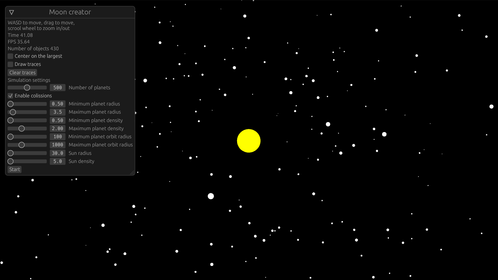

Yet another n-body simulation in Rust
-------------------------------------

This is a weekend project utilizing several technologies:
- [Bevy](https://bevyengine.org/) - game engine
- [egui](https://github.com/emilk/egui) - UI elements
- [webassembly](https://github.com/rustwasm/wasm-bindgen) - wasm-bindgen is used to compile Rust to webassembly which can be run in the browser

The code to calculate velocities of objects is naive all pairs algorithm which can handle up to 1000 objects in 60.0 FPS on a laptop.
Web version is 4x slower which means it can handle around 500 objects.

### Screenshot



### Demo

https://pjankiewicz.github.io/nbody/index.html

### Running desktop application

```
cargo run --release
```

### Building webassembly version

```bash
cargo build --release --target wasm32-unknown-unknown
wasm-bindgen --out-dir ./out/ --target web ./target/wasm32-unknown-unknown/release/nbody.wasm
```

Running 

```
python -m http.server
```

And navigate to http://localhost:8000 in your browser.